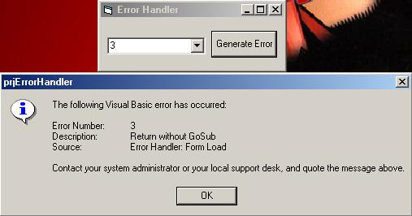

## Error Handler \-RW

### Description

This class sets a generic rule for your program to follow in the event of errors. The class is setup to handle all basic trapable errors. The layout of the messagebox i found on here, but i do not remember the authors name.
 
### More Info
 

             |
---                |---
**Submitted On**   |2005-02-28 14:53:22
**By**             |[Ryan Wiltshire](https://github.com/Planet-Source-Code/PSCIndex/blob/master/ByAuthor/ryan-wiltshire.md)
**Level**          |Intermediate
**User Rating**    |5.0 (10 globes from 2 users)
**Compatibility**  |VB 5\.0, VB 6\.0, VBA MS Access, VBA MS Excel
**Category**       |[Debugging and Error Handling](https://github.com/Planet-Source-Code/PSCIndex/blob/master/ByCategory/debugging-and-error-handling__1-26.md)
**World**          |[Visual Basic](https://github.com/Planet-Source-Code/PSCIndex/blob/master/ByWorld/visual-basic.md)
**Archive File**   |[Error\_Hand1858742282005\.zip](https://github.com/Planet-Source-Code/ryan-wiltshire-error-handler-rw__1-59207/archive/master.zip)

